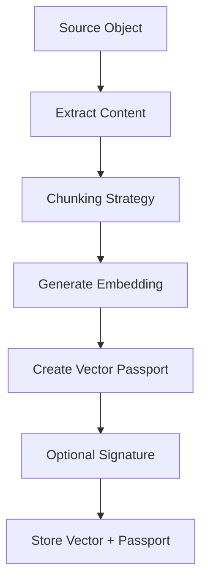
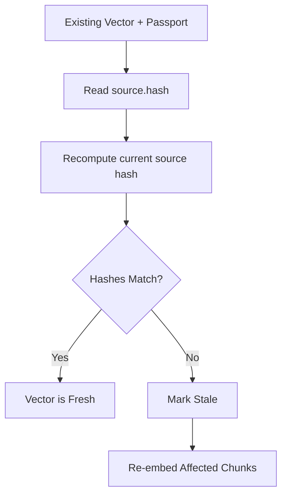

# Vector Passport Specification

**Version:** 1.0  
**Status:** Draft  
**License:** Apache 2.0  
**Canonical schema:** [spec/v1.0/schema.json](spec/v1.0/schema.json)

## 1. Abstract

Vector Passport is an open, lightweight metadata standard that attaches rich, self-describing provenance information to every embedding vector used in AI, RAG, and semantic search systems.

A Vector Passport travels with the vector and records:

- the original source object and exact source region
- the chunking strategy used
- the embedding model and parameters
- timestamps and hashes for change detection
- lifecycle and staleness state
- optional cryptographic signature for integrity
- extension metadata for project or vendor-specific needs

The goal is to turn vectors from opaque lists of numbers into managed, portable, and auditable data assets.

## 2. Motivation

Modern RAG and semantic search systems suffer from several systemic problems.

| Problem | Current State | Impact |
| --- | --- | --- |
| Vector lock-in | Vectors are tightly coupled to one system | Hard to migrate between vector databases or storage platforms |
| Expensive re-embedding | No reliable way to know what needs refreshing | Teams re-embed everything on model upgrades or data changes |
| Poor observability | Little visibility into vector provenance | Hard to debug, audit, or explain AI answers |
| Fragile pipelines | Custom scripts manage chunking and embedding | Brittle when models or chunking strategies change |
| Weak lifecycle management | Stale vectors are hard to identify reliably | Indexes drift away from the source corpus |

Vector Passport addresses these by making provenance first-class data that travels with every vector.

## 3. Design Goals

| Goal | Description | Priority |
| --- | --- | --- |
| Portability | Vectors and metadata should be movable between systems with minimal friction | High |
| Lightweight | Small enough to store alongside every vector without significant overhead | High |
| Self-describing | A passport should be understandable without external context | High |
| Extensible | Easy to add vendor-specific or future fields without breaking compatibility | High |
| Model and chunking agnostic | Works with any embedding model and chunking strategy | High |
| Multimodal ready | Supports text, image, video, audio, multimodal, and other content | High |
| Security and integrity | Optional signing and hashes for tamper and change detection | Medium |
| Human and machine readable | Easy for engineers and automated systems to consume | Medium |

Non-goals:

- standardizing how chunking or embedding is performed
- replacing existing vector database schemas
- mandating any specific embedding model
- mandating any specific vector database or storage backend
- defining retrieval ranking, reranking, or application behavior

## 4. Data Model

A Vector Passport is a JSON object. The authoritative field constraints are defined in [spec/v1.0/schema.json](spec/v1.0/schema.json).

### 4.1 Top-Level Fields

| Field | Type | Required | Description |
| --- | --- | --- | --- |
| `passport_version` | string | Yes | Version of this specification. Must be `"1.0"`. |
| `vector_id` | string | Yes | Unique identifier for this vector. UUIDs or content-addressed IDs are recommended. |
| `source` | object | Yes | Information about the original source object. |
| `chunk` | object | Yes | Information about the source region represented by the vector. |
| `embedding` | object | Yes | Embedding model metadata and parameters. |
| `created_at` | string | Yes | ISO 8601 timestamp when the vector was created. |
| `created_by` | string | No | Pipeline, service, user, or process that created the vector. |
| `staleness` | object | No | Current validity state relative to the source object. |
| `vector_hash` | string | No | Hash of the vector values, prefixed with the hash algorithm. |
| `modality` | string | No | Content type: `text`, `image`, `video`, `audio`, `multimodal`, or `other`. |
| `lineage` | array | No | History of lifecycle events such as creation, staleness checks, re-embedding, or model upgrades. |
| `signature` | string or null | No | Optional cryptographic signature over canonical passport content. |
| `extensions` | object | No | Vendor, project, or deployment-specific extension fields. |

Top-level fields not listed above are not allowed in v1.0. Custom data belongs under `extensions`.

### 4.2 `source` Object

| Field | Type | Required | Description |
| --- | --- | --- | --- |
| `uri` | string | Yes | Location or stable identifier for the original source object. Examples: `s3://`, `file://`, `https://`. |
| `hash` | string | Yes | Content hash of the source object at the time of vector creation. Format should be algorithm-prefixed, such as `sha256:...`. |
| `last_modified` | string | No | Observed source modification timestamp when the vector was created. |
| `mime_type` | string | No | MIME type of the source object. |
| `size_bytes` | integer | No | Size of the source object in bytes. |
| `metadata` | object | No | Additional source-level metadata. |

### 4.3 `chunk` Object

| Field | Type | Required | Description |
| --- | --- | --- | --- |
| `id` | string | No | Stable identifier for this chunk within the source object. |
| `strategy` | string | Yes | Name and optional version of the chunking strategy. Example: `recursive-character-512-50@1.0.0`. |
| `unit` | string | No | Unit for offsets. Allowed values: `byte`, `character`, `token`, `page`, `time`, `pixel`, `frame`, `region`, `other`. |
| `start` | integer | No | Inclusive chunk start offset in the chosen unit. |
| `end` | integer | No | Exclusive chunk end offset in the chosen unit. |
| `page` | integer | No | Page number for paged documents. |
| `hash` | string | No | Hash of the exact chunk payload represented by the vector. |
| `metadata` | object | No | Additional chunk metadata, such as heading, section, speaker, slide, or bounding box. |

### 4.4 `embedding` Object

| Field | Type | Required | Description |
| --- | --- | --- | --- |
| `model` | string | Yes | Name of the embedding model. |
| `model_version` | string | No | Exact model version, revision, or release identifier. |
| `provider` | string | No | Model provider or publisher. |
| `dimension` | integer | Yes | Dimensionality of the vector. |
| `parameters` | object | No | Model-specific embedding parameters. |

### 4.5 `staleness` Object

| Field | Type | Required | Description |
| --- | --- | --- | --- |
| `status` | string | No | One of `current`, `stale`, `source_missing`, `unchecked`, or `superseded`. |
| `checked_at` | string | No | ISO 8601 timestamp for the last staleness check. |
| `reason` | string | No | Human-readable explanation for the current status. |

### 4.6 `lineage` Events

Each lineage item is an object with:

| Field | Type | Required | Description |
| --- | --- | --- | --- |
| `event` | string | Yes | Event name, such as `initial_creation`, `marked_stale`, `reembedded`, or `model_upgraded`. |
| `timestamp` | string | Yes | ISO 8601 timestamp for the event. |
| `details` | object | No | Event-specific details. |

Lineage should be append-only where practical.

## 5. JSON Schema

The authoritative JSON Schema for v1.0 is:

```text
spec/v1.0/schema.json
```

The planned hosted schema URL is:

```text
https://vectorpassport.org/schema/v1.0
```

Implementations should validate passports against the JSON Schema when creating, importing, exporting, or migrating vectors.

## 6. Recommended Workflows

### 6.1 Creation Workflow



### 6.2 Staleness Detection Workflow



### 6.3 Model Upgrade Workflow

1. A new embedding model is released.
2. The system scans existing passports.
3. It identifies vectors where:
   - the source file has changed,
   - the current embedding model differs from the target model,
   - the chunk or use case is high priority,
   - the prior vector is superseded or stale.
4. It re-embeds only the subset that needs it.
5. It updates `lineage` and staleness metadata.

### 6.4 Vector Database Integration

Store the passport alongside the vector in the vector database metadata or payload layer:

```json
{
  "id": "vector-id",
  "vector": [0.0123, -0.0456, 0.0789],
  "payload": {
    "text": "Our revenue grew 27%...",
    "passport": {
      "passport_version": "1.0",
      "source": {
        "uri": "s3://company-docs/q3-report.pdf",
        "hash": "sha256:..."
      },
      "embedding": {
        "model": "nomic-embed-text-v1.5",
        "dimension": 768
      }
    }
  }
}
```

Some systems may store the passport as nested JSON. Others may store it as a JSON string plus selected indexed columns. Both patterns are valid as long as the passport can be recovered and validated.

## 7. Use Cases

| Use Case | Description | Value |
| --- | --- | --- |
| Smart re-embedding | Only re-embed vectors whose source changed or that benefit from a new model | High |
| Cross-platform migration | Move vectors between vector databases or storage systems safely | High |
| Automated data hygiene | Continuously detect and refresh stale vectors | High |
| Audit and compliance | Maintain provenance for every vector used in AI responses | Medium-high |
| Multi-model strategies | Run multiple embedding models and compare results with clear metadata | Medium |
| Debugging and explainability | Trace exactly which document chunk and model produced a vector | Medium |
| Vector observability | Build dashboards over freshness, model mix, source coverage, and lineage | Medium |

## 8. Security And Privacy Considerations

- **Integrity:** `source.hash`, `chunk.hash`, and `vector_hash` support change and integrity checks.
- **Signing:** The optional `signature` field can hold an ECDSA signature over canonical passport content with `signature` omitted.
- **Trust:** Signatures allow downstream systems to verify that a passport came from a trusted pipeline.
- **Privacy:** Source URIs, filenames, headings, and extension metadata may reveal sensitive information.
- **Redaction:** Sensitive operational details should be redacted, tokenized, encrypted, or placed in controlled `extensions`.
- **Key management:** Private signing keys must be stored securely and rotated according to local security policy.

## 9. Schema Evolution And Versioning Strategies

Vector Passport is designed for long-term evolution while preserving compatibility across tools, vector databases, storage systems, and organizations.

The key tension is deliberate: the core passport schema should be stable enough for interoperability, but flexible enough for new modalities, model metadata, lifecycle events, and vendor-specific capabilities.

### 9.1 Core Principles

| Principle | Description | Why It Matters |
| --- | --- | --- |
| Backward compatibility | Any v1.x implementation should be able to read passports created under earlier v1.y versions. | Prevents ecosystem fragmentation and protects existing vector estates. |
| Forward compatibility | Older implementations should either ignore unsupported optional data or preserve it under `extensions`. | Enables gradual adoption across mixed toolchains. |
| Explicit versioning | Every passport declares `passport_version`. | Allows consumers to branch behavior safely. |
| Minimal breaking changes | Major version bumps are rare and require clear migration guidance. | Protects operational systems that may store millions or billions of passports. |
| Extensibility through `extensions` | Vendor-specific, project-specific, or experimental fields live under `extensions`. | Keeps the core schema stable while allowing innovation. |
| Schema as contract | The JSON Schema is the machine-readable compatibility boundary. | Makes validation, CI, import/export, and migration tooling reliable. |
| Preserve provenance | Evolution must not weaken traceability to source, chunk, model, and lifecycle state. | Provenance is the primary value of the standard. |

### 9.2 Recommended Evolution Strategies

| Strategy | When To Use | Implementation Guidance | Compatibility Impact |
| --- | --- | --- | --- |
| Add optional top-level or nested field | Broadly useful new capabilities that should become part of the common contract. | Add the field as optional in a minor version, document default behavior, and add examples. | Backward safe for newer readers; older strict v1.0 validators may reject it unless validating against the newer schema. |
| Use `extensions` | Vendor-specific data, experimental features, deployment-specific metadata, or temporary workarounds. | Place data under `extensions.{vendor_or_project}.{field}`. Preserve it during import/export. | Safest path. v1.0 readers should accept and round-trip it. |
| Append to `lineage` | Recording lifecycle events such as re-embedding, model upgrades, source re-chunking, staleness checks, or migrations. | Append new events. Avoid editing historical entries except for explicit repair workflows. | Safe when event consumers tolerate unknown event names. |
| Introduce a new `modality` value | Supporting new content types such as `code`, `table`, `geospatial`, or domain-specific media. | Prefer a minor version. Older systems may treat unsupported values as `other` or route to fallback handling. | Mostly safe, but strict enum validation requires an updated schema. |
| Deprecate a field | A field is being replaced by a clearer or more precise alternative. | Mark as deprecated in docs, keep reading it for at least two minor versions, and provide migration guidance. | Backward safe if consumers keep supporting the old field. |
| Add stricter validation | Clarifying allowed values, patterns, or constraints. | Use cautiously. Prefer warnings before hard validation errors. | Can break existing data if previously accepted values become invalid. |
| Major version bump | Required fields or core field semantics must change. | Publish a migration guide, conversion tooling, and compatibility examples. | Breaking by design. Should be rare. |

### 9.3 Minor Version Rules

Minor versions, such as `1.0` to `1.1`, are for compatible evolution.

Allowed minor-version changes:

- add optional fields
- add optional nested objects
- add new lineage event names
- add new extension guidance
- add new examples
- add new non-normative recommendations
- clarify field descriptions without changing meaning
- add new enum values only when fallback behavior is documented

Minor versions must not:

- remove existing fields
- make optional fields required
- change the type of an existing field
- change the meaning of an existing field
- make previously valid v1.x passports invalid without a documented transition path

### 9.4 Major Version Rules

Major versions, such as `1.x` to `2.0`, are reserved for breaking changes.

Examples of major-version changes:

- making `vector_hash` required
- changing the required structure of `embedding`
- replacing `source.hash` semantics
- removing or renaming a core field
- changing the meaning of `chunk.start` and `chunk.end`
- requiring signatures for all passports

Major version changes must include:

- a clear migration guide
- examples before and after migration
- compatibility notes for vector databases and payload formats
- recommended reader behavior for older passports
- preferably an automated migration script or CLI command

Implementations should continue to read older major versions for a documented support window where practical.

### 9.5 Handling Unknown Fields

The v1.0 schema uses `additionalProperties: false` at the top level and inside core objects. This is intentional: the shared interoperability surface should remain predictable.

Therefore:

- unknown top-level fields are not valid v1.0 passport fields
- unknown fields inside `source`, `chunk`, `embedding`, `staleness`, and `lineage` items are not valid unless allowed by the schema
- custom or experimental fields must be placed under `extensions`
- implementations should preserve and round-trip `extensions`
- implementations should ignore extension namespaces they do not understand

Recommended extension shape:

```json
{
  "extensions": {
    "example.com/my-system": {
      "retrieval_score": 0.92,
      "index_name": "finance-prod-v3"
    }
  }
}
```

Extension namespace recommendations:

- use a domain name, package name, or project slug
- avoid short generic keys such as `custom` or `misc`
- document extension fields if other systems are expected to consume them
- avoid storing secrets or sensitive raw text unless encrypted or access-controlled

### 9.6 Future-Proofing Reader Implementations

Readers should:

- check `passport_version` before applying version-specific behavior
- validate against the matching schema when possible
- tolerate missing optional fields
- preserve `extensions` during migration and export
- treat unknown extension namespaces as opaque data
- avoid assuming a passport is text-only
- avoid assuming offsets are character offsets unless `chunk.unit` says so
- avoid assuming one embedding model per database or collection

Writers should:

- emit the most specific `passport_version` they support
- avoid adding non-standard top-level fields
- include hashes wherever practical
- include `created_at`
- include enough model metadata to distinguish incompatible embeddings
- include lineage events when modifying or superseding vectors

### 9.7 Example Evolution Path

**v1.0**

- Core provenance fields
- Source, chunk, embedding, staleness, lineage, signature, and extensions
- JSON Schema stored at `spec/v1.0/schema.json`

**v1.1** example future minor version:

- add optional `quality` object for retrieval or evaluation metadata
- add optional `embedding.context_window`
- add optional `chunk.language`
- add new `modality` value: `code`
- document additional lineage events such as `quality_evaluated`

**v1.2** example future minor version:

- add optional `source.version_id` for object stores with native versioning
- add optional `signature.algorithm`
- add optional `signature.key_id`

**v2.0** example future major version:

- make `vector_hash` required
- replace string `signature` with a structured signature object
- require `chunk.unit` whenever `chunk.start` or `chunk.end` is present
- provide migration tooling that converts v1.x signatures and backfills missing fields where possible

These examples are illustrative, not commitments.

### 9.8 Governance Of Evolution

Changes to the core schema should be proposed through public issues or pull requests.

Schema change proposals should include:

- the interoperability problem being solved
- whether the change is optional or required
- compatibility impact
- example passports before and after the change
- privacy and security implications
- migration guidance when applicable
- updates to reference examples and validation tests

Breaking changes require strong justification and broad consensus. The specification should evolve slowly and deliberately. Stability is a feature.

## 10. Governance

This specification is maintained as an open standard.

- License: Apache 2.0
- Contributions: pull requests and issues
- Compatibility: schema changes should include examples and migration notes
- Reference artifacts:
  - [spec/v1.0/schema.json](spec/v1.0/schema.json)
  - [examples/sample-passport.json](examples/sample-passport.json)
  - [vector_passport.py](vector_passport.py)

Breaking changes require clear justification and migration guidance.

## Appendix A: Example Passport

See [examples/sample-passport.json](examples/sample-passport.json).

## Appendix B: Reference Demos

- [examples/demo.py](examples/demo.py): end-to-end lifecycle
- [examples/model_upgrade_demo.py](examples/model_upgrade_demo.py): model upgrade analysis
- [examples/source_change_detection_demo.py](examples/source_change_detection_demo.py): source-change detection
- [examples/qdrant_integration.py](examples/qdrant_integration.py): Qdrant integration
- [examples/lancedb_integration.py](examples/lancedb_integration.py): LanceDB integration

This document, together with [spec/v1.0/schema.json](spec/v1.0/schema.json), constitutes the Vector Passport v1.0 draft specification.
